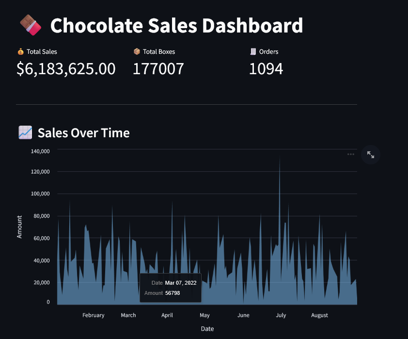
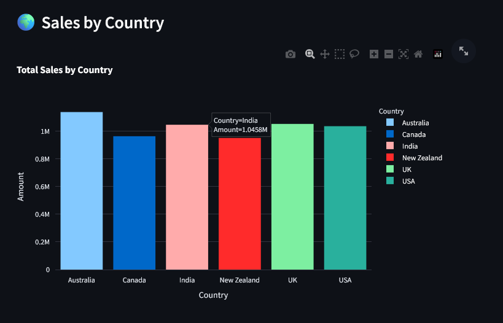
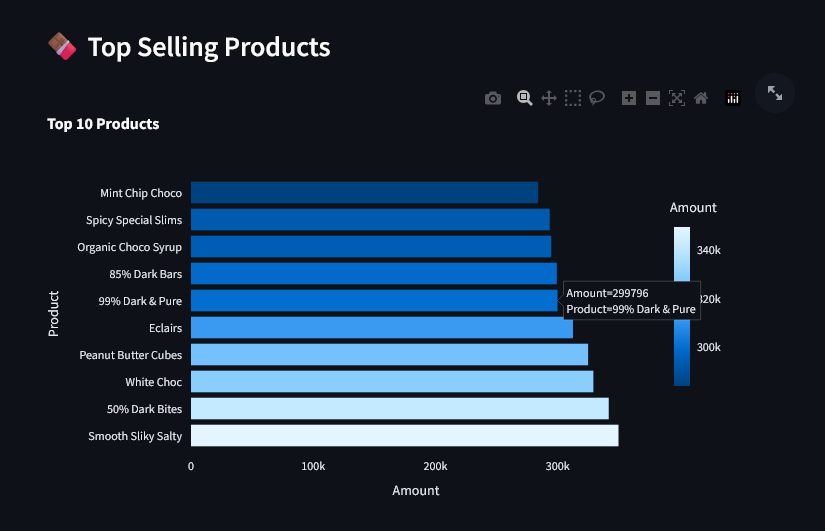

# 🍫 Chocolate Sales Dashboard

An interactive data visualization dashboard built with **Streamlit**, **Plotly**, and **Altair** to explore chocolate sales performance across different countries, products, and time periods.

## 📊 Features

- Filter sales by **Country**, **Product**, and **Date Range**
- Live summary metrics: **Total Sales**, **Boxes Shipped**, **Orders**
- Interactive charts:
  - 📈 Sales Over Time (Altair Area Chart)
  - 🌍 Sales by Country (Plotly Bar)
  - 🍫 Top Selling Products (Horizontal Bar)
  - 🫧 Product Performance Bubble Chart (Boxes vs Amount)

---

## 🖼️ Visual Preview

###  Sales Over Time

Displays sales trends based on date.

---

### Sales by Country

Compare the revenue generated from each country.

---

### Top Selling Products

Bar chart ranking the best-performing products.

---

### Product Performance

Bubble chart representing product-wise sales vs boxes shipped.

---

## Technologies Used

- Python
- Streamlit
- Pandas
- Plotly Express
- Altair

---

## 💡 Inspiration

This dashboard was inspired by real-world business intelligence use cases, aiming to provide insightful, interactive sales analysis using Python tools.

---

##  Author

Made with ❤️ by [Harshitha Sha](https://github.com/zanks08)

