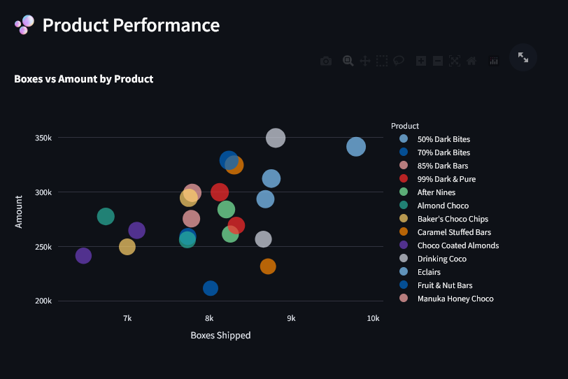

# 🍫 Chocolate Sales Dashboard

This is a **personal experiment dashboard project** where I explored how to build interactive visualizations using **Streamlit**, **Plotly**, and **Altair** — just to play around, try different visuals, and see how dynamic filtering works with real-world-style data.  
I used a chocolate sales dataset and tested how we can present it beautifully with modern Python tools 💻🍫📊

---

## 📊 Features

- Filter chocolate sales by **Country**, **Product**, and **Date Range**
- View quick metrics like **Total Sales**, **Boxes Shipped**, and **Total Orders**
- Try out interactive charts:
  - 📈 **Sales Over Time** (Altair Area Chart)
  - 🌍 **Sales by Country** (Plotly Bar)
  - 🍫 **Top Products** (Horizontal Bar)
  - 🫧 **Product Performance** (Bubble Chart)

---

## 🌐 Want to See It Live?

If you'd like to try out the dashboard yourself in real time —  
👉 just click this link: **[chocolate-sales.streamlit.app](https://chocolate-sales.streamlit.app/)**

> You don't have to install anything — it runs entirely in your browser 💻✨

---

## 🖼️ Visual Preview

### 📈 Sales Over Time

Shows how sales amount trends changed over time.

---

### 🌍 Sales by Country

See which countries contributed the most chocolate sales.

---

### 🍫 Top Selling Products

Top chocolates based on total sales.

---

### 🫧 Product Performance

Bubble chart showing relationship between quantity and sales per product.

---

## 🚀 Technologies Used

- Python
- Streamlit
- Pandas
- Plotly Express
- Altair

---

## 💡 Inspiration

Honestly just wanted to try how it feels to build a **live dashboard**, filter data, and make something fun + interactive from scratch — and this chocolate dataset gave me the perfect excuse 😄

---

## 🙋‍♀️ Author

Made with 🍫 & 💻 by [Harshitha Sha](https://github.com/zanks08)

